# p5js

A collection of creative coding experiments built with [p5.js](https://p5js.org/) -	 generative art,
image manipulation, simulations, and algorithmic sketches.

## Getting Started

Sketches are loaded via `loader.html`.

```
http://localhost:80/p5js/loader.html?sketches=AbstractAlgorithm.js
```

The `loader.html` page loads p5.js and calls the sketch function. Multiple sketches can
be loaded from `index.html`, each with their own instantiation.

## Directory Layout

```
p5js/
  loader.html        -	 Single-sketch loader
  index.html         -	 Multi-sketch launcher
  sketches/          -	 All sketch source files
  assets/
    images/          -	 Source images for processing sketches
    text/            -	 Training text for generative text sketches
```

## Sketches

All sketches live in `sketches/`. Here is what each one does:

### AbstractAlgorithm.js

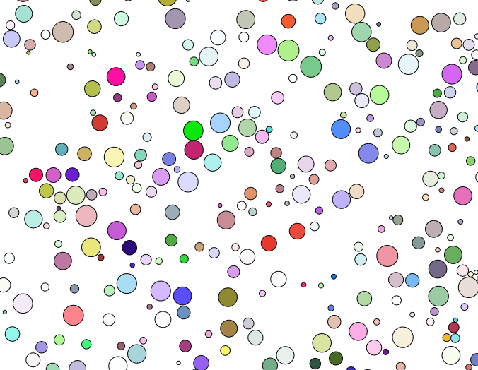

Procedurally packs circles onto the canvas using a collision-avoidance
algorithm. Circles are placed one by one - each new circle checks for overlap
against all existing circles. On collision, it shifts position and retries
up to a configurable number of attempts. The result is a space-filling
arrangement of non-overlapping circles, reminiscent of a bubble packing
or abstract cellular pattern.

### calmCircles.js

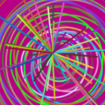

An animated, colorful circle explosion. Each frame paints a new concentric
ring composition with random colors, while lines radiate from the center.
Clicking spawns a burst of lines from the mouse position. The name is ironic -
the visual output is anything but calm.

### Cubes.js

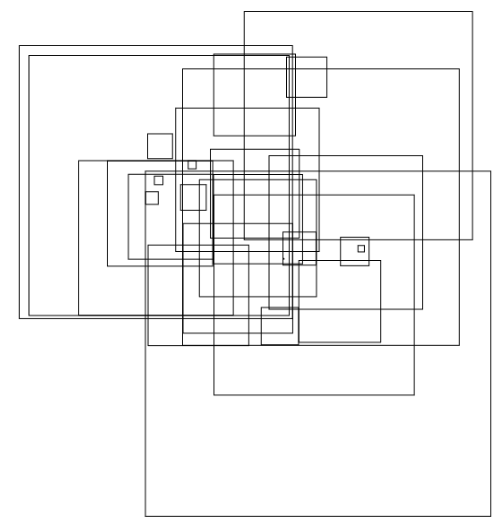

Minimalist procedural grid art. On load it scatters 30 randomly-sized squares
around the center of the canvas. Each click adds more squares with increasing
size. The result evolves into a layered, abstract composition reminiscent of
a city skyline or cubist collage.

### GameOfLive.js

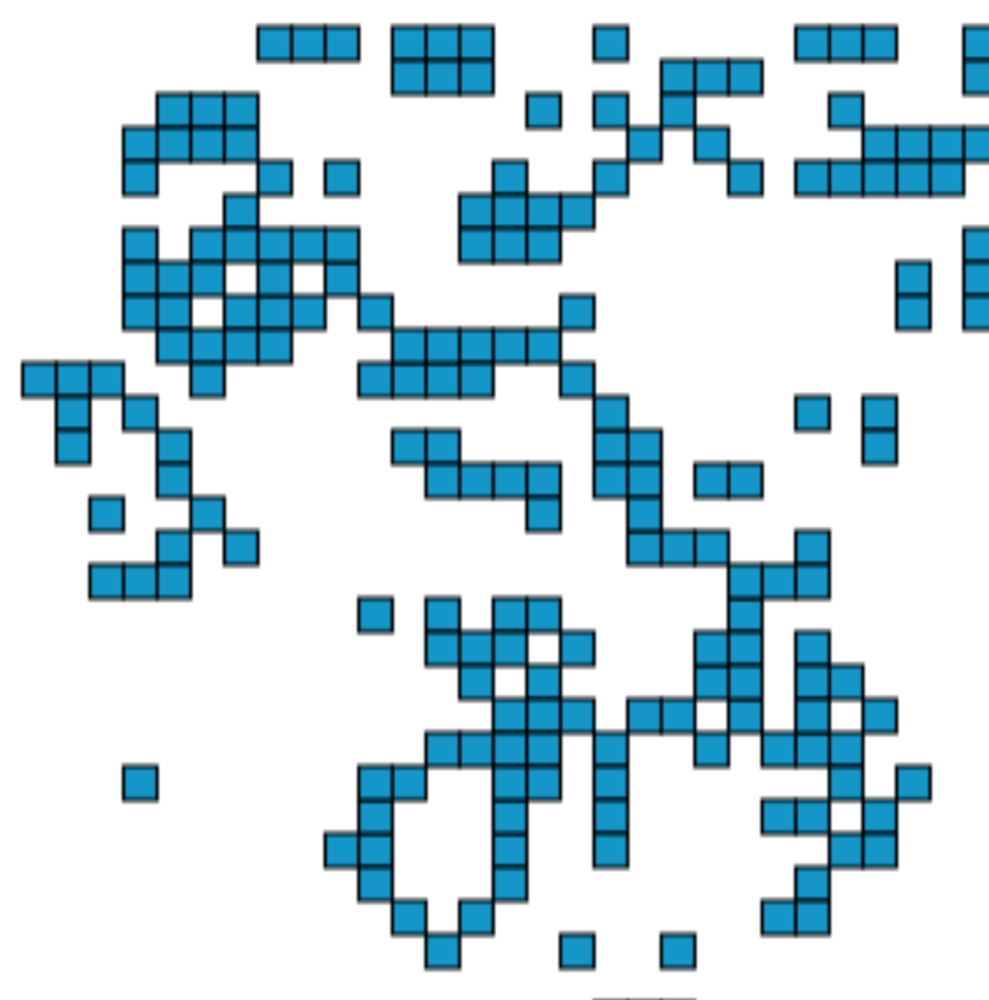

A custom implementation of Conway's Game of Life, rendered as colored squares
on a dark blue grid. Seeds several glider patterns and continuously spawns
random blocks across the canvas. The simulation evolves one generation per
frame -	 watch patterns drift, collide, and dissolve.

### L-System.js

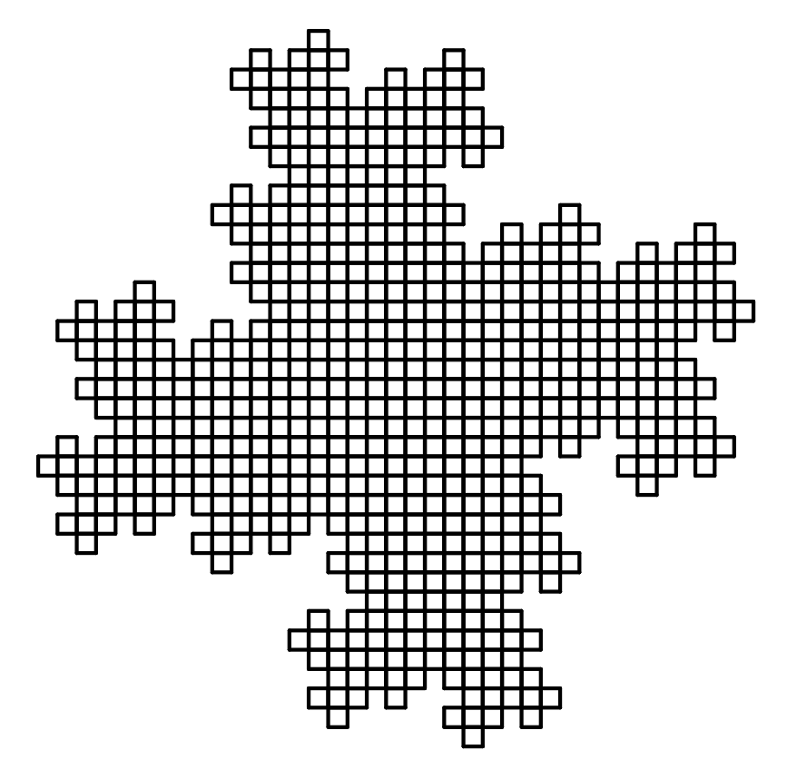

A full L-System fractal generator with 33 preset configurations. Draws
everything from classic Koch snowflakes and Dragon curves to intricate plants,
bushes, algae, and kolam patterns. Supports the full Bourke L-System symbol
set including turtle-graphics tokens (`F`, `+`, `-`, `[`, `]`), line width
control, polygon fills, and rule-based branching. A great showcase of how
simple rewriting rules produce complex organic and geometric forms.

### labyrinth.js

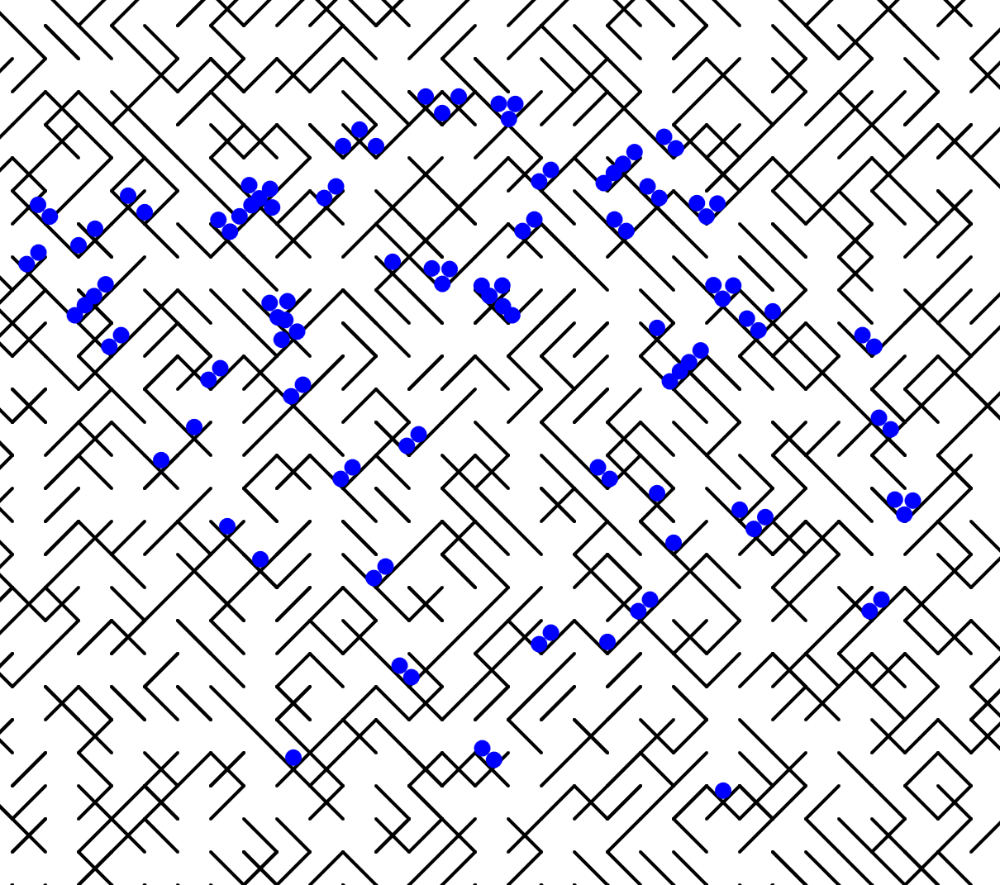

Procedural maze generation with physics-based water simulation. Generates
a labyrinth of diagonal walls, then fills it with particle-based fluid dynamics -
gravity, cohesion, damping, wall collisions, and substep integration.
The water flows through the maze, pooling and trickling along paths.
A hybrid of maze generation and real-time fluid simulation.

### MarkovChain.js

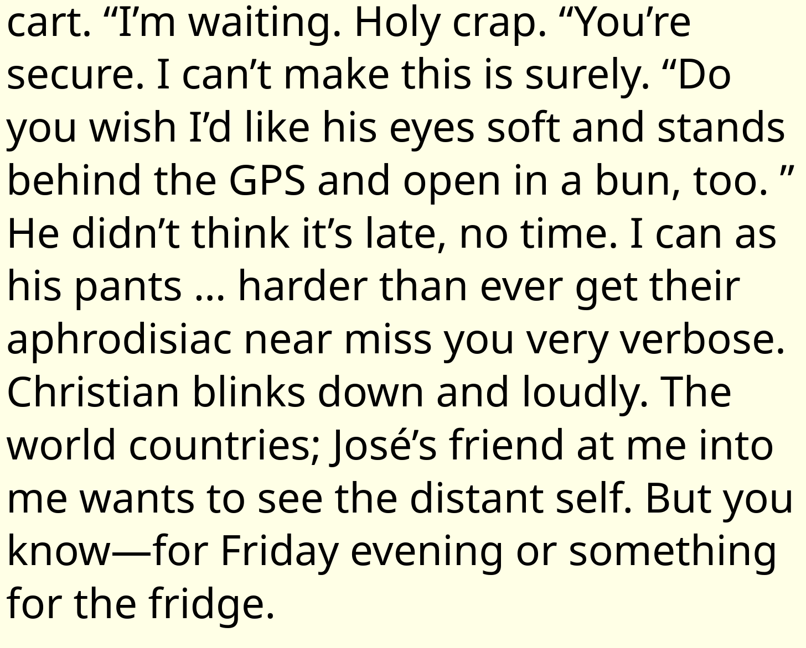

A Markov-chain text generator trained on the source text of The bible.
Builds a word-level transition table from the corpus, then generates a 100-word
passage by walking the chain. The output is rendered directly onto the canvas -
a collision of literary trash and statistical language modeling.

### snake.js

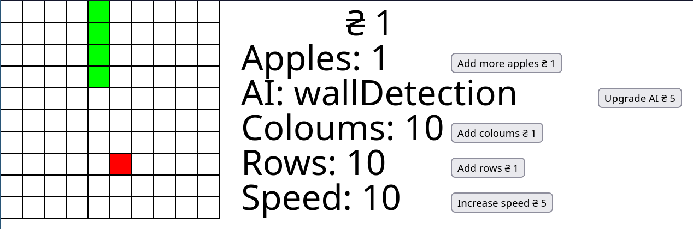

A classic Snake game with an upgrade shop. Eat apples to grow, then spend
your score on upgrades: bigger grid, more apples, faster speed, and smarter
AI (snake starts random, upgrades to more directed movement). Pure arcade fun
with incremental progression.

### snakeAIEvolution.js

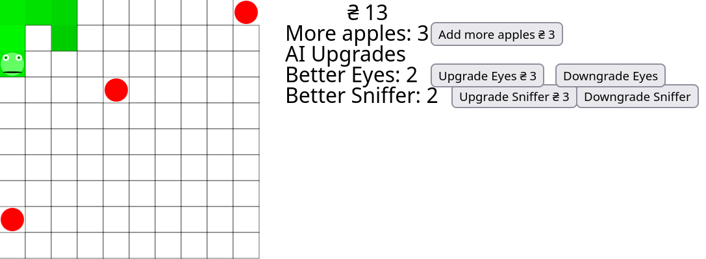

A feature-expanded version of snake.js. Adds a sensory system to the AI snake:
a configurable "sniffer" (detects food at a distance) and "eyes" (detects
walls/body ahead), each with their own upgrade tree and price scaling.
The AI transitions from random wandering to increasingly informed pathfinding
as you invest points. A playful experiment in incremental AI complexity.

### 2images.js

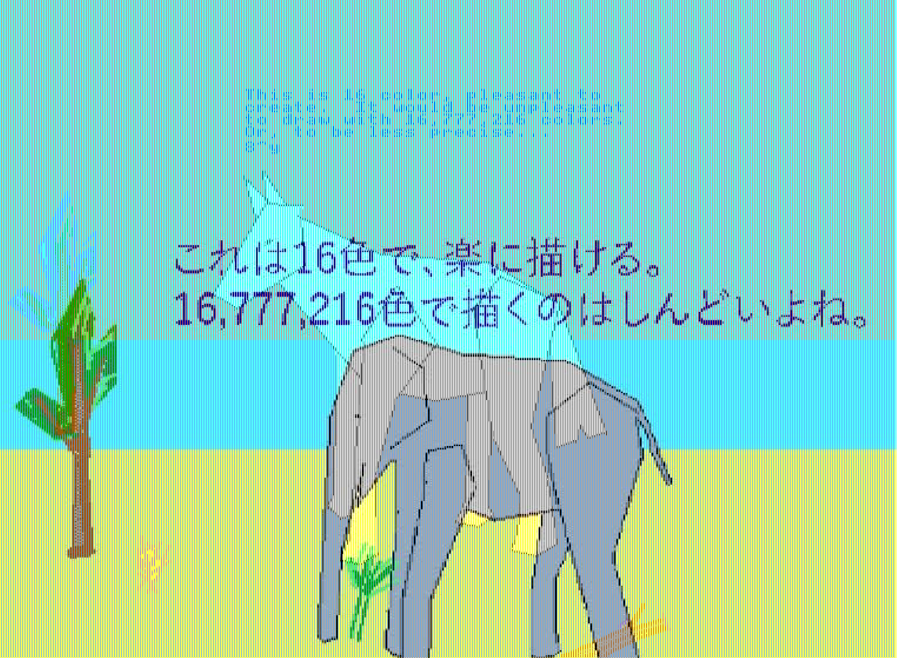

Blends two images together pixel by pixel - an image-processing sketch that
alternates rows from image 1 (even columns) and image 2 (odd columns),
creating a vertical-striped composite. A visual crossfade at the pixel level.

### image.js

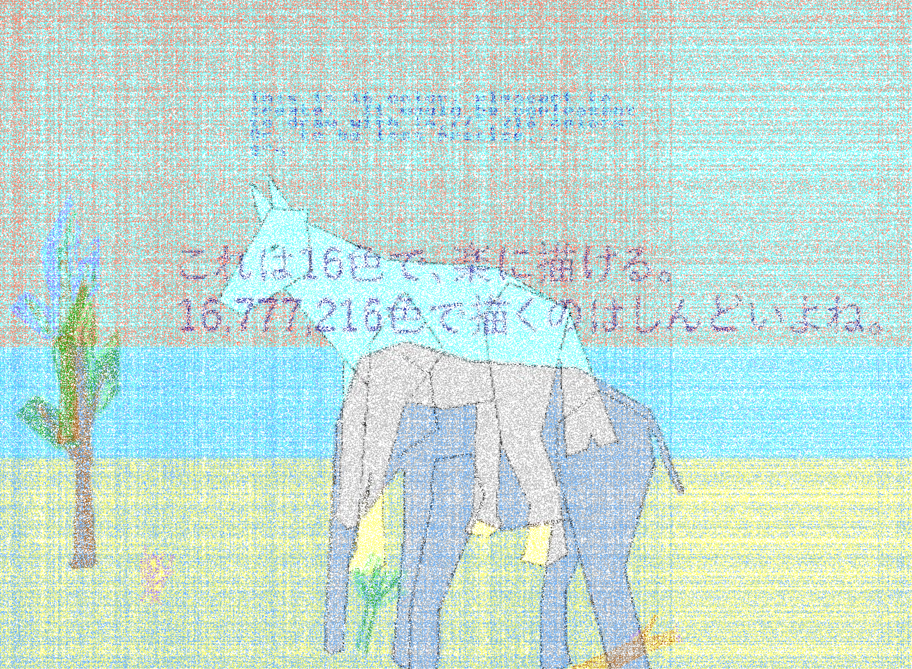

Draws images in rapidly changing tiling patterns - rows, columns, corner-to-corner
sweeps, and mixed layouts. Every few frames it randomly switches direction and
grid dimensions. Creates a stroboscopic collage effect as the two source images
overlap in shifting arrangements.

### imageNoice.js

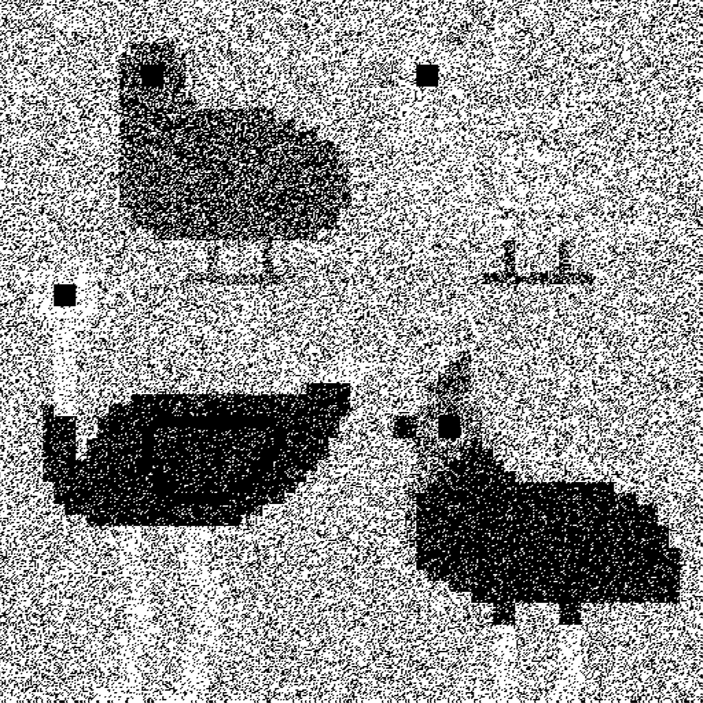

Applies a threshold filter to a pixel-art bird image. Each pixel is compared
against a random threshold - if the combined RGB value falls below the threshold,
it turns black; otherwise white. The result is a noisy, dithered monochrome
version of the source, re-rendered row by row.

### imageOverlap.js

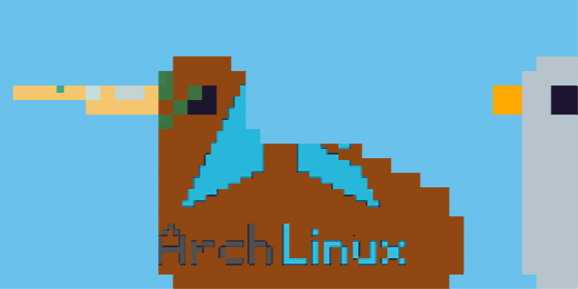

Overlays up to three images using a per-pixel selection rule. For each of the
R, G, B channels independently, a random mode decides whether to pick the
highest, lowest, or average value from the loaded images. The result is a
hybrid image that blends textures in unpredictable ways - part collage,
part chance operation.

---

### AI generated code:

In this project an AI model was rearly used to generate code.
all the code is written by me and any code written by an AI model is labelled accordeingly.

Built with [p5.js](https://p5js.org/) -	 creative coding for everyone.
